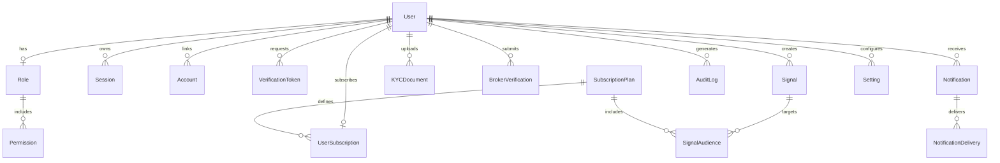

# Entity Relationship Diagram

> **Version:** 1.0
> **Status:** Approved
> **Last Updated:** June 2026

---

# 1. Complete Entity Relationship Diagram

---

# 2. Entity Relationships

## 2.1 User to Role

| Relationship | Type | Description |
|-------------|------|-------------|
| User -> Role | Many-to-One | Every user has exactly one role |
| Foreign Key | `user.role_id` -> `role.id` | |
| Cascade | RESTRICT | Cannot delete a role assigned to users |

## 2.2 Role to Permission

| Relationship | Type | Description |
|-------------|------|-------------|
| Role -> Permission | Many-to-Many | Roles group multiple permissions |
| Join Table | `role_permission` | |
| Cascade | CASCADE | Deleting a role removes its permission links |

## 2.3 User to Session

| Relationship | Type | Description |
|-------------|------|-------------|
| User -> Session | One-to-Many | User can have multiple active sessions |
| Foreign Key | `session.user_id` -> `user.id` | |
| Cascade | CASCADE | Deleting a user removes all sessions |

## 2.4 User to Account

| Relationship | Type | Description |
|-------------|------|-------------|
| User -> Account | One-to-Many | User can link multiple OAuth accounts |
| Foreign Key | `account.user_id` -> `user.id` | |
| Cascade | CASCADE | Deleting a user removes all linked accounts |

## 2.5 User to Subscription

| Relationship | Type | Description |
|-------------|------|-------------|
| User -> UserSubscription | One-to-One | Active user has one current subscription |
| Foreign Key | `user_subscription.user_id` -> `user.id` | |
| Cascade | CASCADE | Deleting a user removes subscription history |

## 2.6 SubscriptionPlan to UserSubscription

| Relationship | Type | Description |
|-------------|------|-------------|
| Plan -> UserSubscription | One-to-Many | A plan can have many subscribers |
| Foreign Key | `user_subscription.plan_id` -> `subscription_plan.id` | |
| Cascade | RESTRICT | Cannot delete a plan with active subscribers |

## 2.7 User to KYC

| Relationship | Type | Description |
|-------------|------|-------------|
| User -> KYCDocument | One-to-Many | User can submit multiple KYC attempts |
| Foreign Key | `kyc_document.user_id` -> `user.id` | |
| Cascade | CASCADE | Deleting a user removes KYC documents |

## 2.8 User to Broker Verification

| Relationship | Type | Description |
|-------------|------|-------------|
| User -> BrokerVerification | One-to-Many | User can submit multiple verification attempts |
| Foreign Key | `broker_verification.user_id` -> `user.id` | |
| Cascade | CASCADE | Deleting a user removes broker verifications |

## 2.9 User to Notification

| Relationship | Type | Description |
|-------------|------|-------------|
| User -> Notification | One-to-Many | User receives many notifications |
| Foreign Key | `notification.user_id` -> `user.id` | |
| Cascade | CASCADE | Deleting a user removes notifications |

## 2.10 Notification to NotificationDelivery

| Relationship | Type | Description |
|-------------|------|-------------|
| Notification -> NotificationDelivery | One-to-Many | One notification is delivered through multiple channels |
| Foreign Key | `notification_delivery.notification_id` -> `notification.id` | |
| Cascade | CASCADE | Deleting a notification removes delivery records |

## 2.11 User to AuditLog

| Relationship | Type | Description |
|-------------|------|-------------|
| User -> AuditLog | One-to-Many | User actions generate audit records |
| Foreign Key | `audit_log.user_id` -> `user.id` | |
| Cascade | RESTRICT | Audit logs are immutable |

## 2.12 User to Signal

| Relationship | Type | Description |
|-------------|------|-------------|
| User -> Signal | One-to-Many | Admins create trading signals |
| Foreign Key | `signal.created_by` -> `user.id` | |
| Cascade | RESTRICT | Signals are not deleted when a user is deleted |

## 2.13 Signal to SignalAudience

| Relationship | Type | Description |
|-------------|------|-------------|
| Signal -> SignalAudience | One-to-Many | A signal targets one or more subscription plans |
| Foreign Key | `signal_audience.signal_id` -> `signal.id` | |
| Cascade | CASCADE | Deleting a signal removes audience targets |

## 2.14 SubscriptionPlan to SignalAudience

| Relationship | Type | Description |
|-------------|------|-------------|
| Plan -> SignalAudience | One-to-Many | A plan is targeted by many signals |
| Foreign Key | `signal_audience.plan_id` -> `subscription_plan.id` | |
| Cascade | CASCADE | Deleting a plan removes audience links |

---

# 3. Relationship Summary

| Entity | Related Entity | Type |
|--------|---------------|------|
| User | Role | N:1 |
| User | Session | 1:N |
| User | Account | 1:N |
| User | VerificationToken | 1:N |
| User | UserSubscription | 1:1 |
| User | KYCDocument | 1:N |
| User | BrokerVerification | 1:N |
| User | Notification | 1:N |
| User | AuditLog | 1:N |
| User | Signal | 1:N |
| Role | Permission | N:M |
| SubscriptionPlan | UserSubscription | 1:N |
| SubscriptionPlan | SignalAudience | 1:N |
| Notification | NotificationDelivery | 1:N |
| Signal | SignalAudience | 1:N |

---

# 4. Cascade Rules

| Foreign Key | Delete Cascade | Update Cascade |
|-------------|---------------|---------------|
| user -> role | RESTRICT | CASCADE |
| session -> user | CASCADE | CASCADE |
| account -> user | CASCADE | CASCADE |
| verification_token -> user | CASCADE | CASCADE |
| user_subscription -> user | CASCADE | CASCADE |
| user_subscription -> plan | RESTRICT | CASCADE |
| kyc_document -> user | CASCADE | CASCADE |
| broker_verification -> user | CASCADE | CASCADE |
| notification -> user | CASCADE | CASCADE |
| notification_delivery -> notification | CASCADE | CASCADE |
| audit_log -> user | RESTRICT | CASCADE |
| signal -> user | RESTRICT | CASCADE |
| signal_audience -> signal | CASCADE | CASCADE |
| signal_audience -> plan | CASCADE | CASCADE |
| role_permission -> role | CASCADE | CASCADE |
| role_permission -> permission | CASCADE | CASCADE |

---

# Related Documents

- DATABASE_DESIGN.md
- DATA_DICTIONARY.md
- ADR-005 — PostgreSQL (Neon)
- ADR-004 — Prisma ORM
